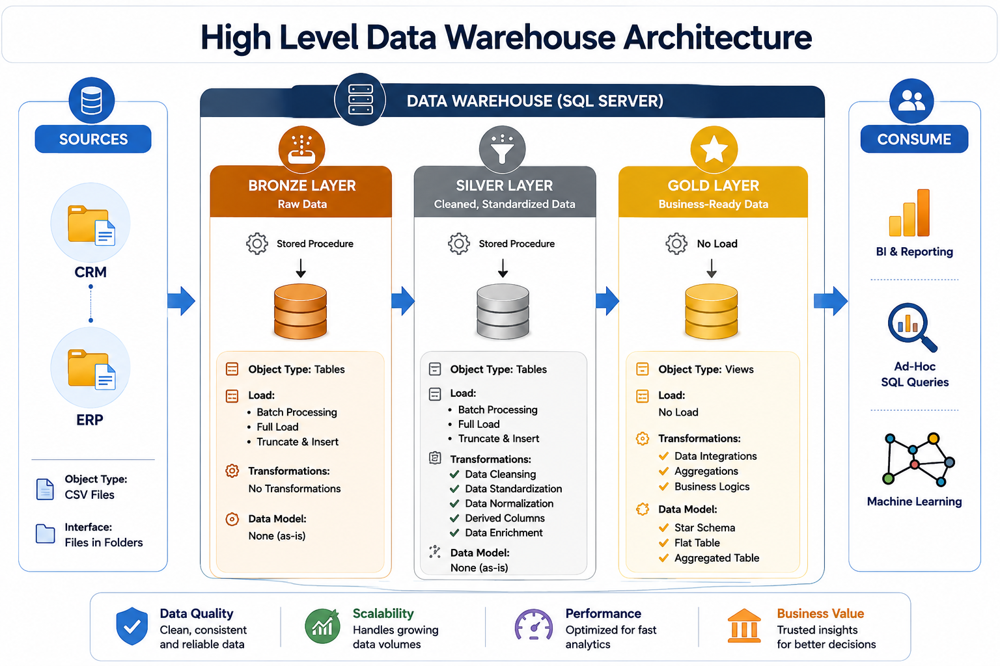

# SQL Data Warehouse Project

An end-to-end **SQL Data Warehouse** project built using the **Medallion Architecture (Bronze → Silver → Gold)**.

This project demonstrates how raw CRM and ERP data can be extracted, loaded, cleaned, transformed, integrated, and modeled into an analytics-ready **star schema** using **Microsoft SQL Server**.

---

## 🏗️ Data Architecture

The project follows the **Medallion Architecture**, separating data processing into three layers:



1. **Bronze Layer** – Raw data landed exactly as received from source CSV files (CRM & ERP). No transformations.
2. **Silver Layer** – Cleaned, standardized, and quality-checked data. Duplicates handled, data types fixed, values normalized.
3. **Gold Layer** – Business-ready data modeled as a **star schema** (dimensions + fact) for analytics and reporting.

---

## 📖 Project Overview

The main objective of this project is to build a modern SQL data warehouse that consolidates sales-related data from **CRM and ERP systems** into a single analytics-friendly model.

The project demonstrates:

| Area                  | Implementation                                              |
| --------------------- | ----------------------------------------------------------- |
| **Data Architecture** | Bronze → Silver → Gold Medallion Architecture               |
| **ETL Pipeline**      | Extract → Load → Transform                                  |
| **Data Loading**      | SQL Server `BULK INSERT`                                    |
| **Data Cleaning**     | Nulls, duplicates, invalid values, inconsistent formats     |
| **Data Integration**  | CRM + ERP source systems                                    |
| **Data Modeling**     | Star Schema                                                 |
| **Data Quality**      | Validation checks across Bronze, Silver and Gold            |
| **Documentation**     | Data catalogs, naming conventions and architecture diagrams |
| **Version Control**   | Git & GitHub                                                |

## Skills showcased: 
SQL development, ETL design, data modeling, data quality, documentation.
---

## 🛠️ Tools & Technologies

* **Microsoft SQL Server**
* **SQL Server Management Studio (SSMS)**
* **T-SQL**
* **Git**
* **GitHub**
* **CSV Source Files**
---

# 🚀 Project Requirements

## 🎯 Data Engineering Goal

Build a SQL-based data warehouse that consolidates sales-related information from CRM and ERP systems and transforms it into a reliable, analytics-ready data model.

The warehouse is designed to support:

* Business reporting
* Sales analysis
* Customer analysis
* Product analysis
* Data quality validation
* Analytical queries

---

## 📌 Key Specifications

### Source Systems

The project uses data from two source systems:

**CRM**

* `cust_info`
* `prd_info`
* `sales_details`

**ERP**

* `CUST_AZ12`
* `LOC_A101`
* `PX_CAT_G1V2`

### Data Quality

The project identifies and resolves common data-quality issues such as:

* Missing values
* Duplicate records
* Invalid dates
* Incorrect data types
* Inconsistent gender values
* Inconsistent marital-status values
* Inconsistent product-line codes
* Invalid product and customer references

### Data Integration

CRM and ERP datasets are integrated into a unified data warehouse model.

### Data Scope

This project focuses on the **latest available snapshot** of the data.

It does not implement full historical tracking such as **Slowly Changing Dimension Type 2 (SCD Type 2)**.

---

# 📂 Repository Structure

```text
sql-data-warehouse-project/
│
├── dataset/
│   ├── source_crm/
│   │   ├── cust_info.csv
│   │   ├── prd_info.csv
│   │   └── sales_details.csv
│   │
│   └── source_erp/
│       ├── CUST_AZ12.csv
│       ├── LOC_A101.csv
│       └── PX_CAT_G1V2.csv
│
├── docs/
│   ├── data_Architecture.png
│   ├── data_Flow.png
│   ├── Data Integration.png
│   ├── data_catalog_bronze.md
│   ├── data_catalog_silver.md
│   ├── data_catalog_gold.md
│   └── naming_conventions.md
│
├── scripts/
│   │
│   ├── Bronze/
│   │   ├── CreateDatabase_Schemas.sql
│   │   ├── CreateBronze_Tables.sql
│   │   ├── Insert_BulkData_into_Tables.sql
│   │   └── BronzeLayer_Data_Quality_Check.sql
│   │
│   ├── Silver/
│   │   ├── Silver_Layer_Tables.sql
│   │   ├── Bronze_to_Silver_Data_Inserting.sql
│   │   └── SilverLayer_Data_Cleansing_Quality_Checking.sql
│   │
│   └── Gold/
│       ├── Creating_Gold_Layer_Tables.sql
│       └── Gold_Layer_Data_Cleaning.sql
│
└── README.md
```

---

# 🔄 ETL Workflow

The complete data pipeline follows this process:

```text
CRM CSV Files ──────┐
                    │
                    ▼
              🥉 BRONZE LAYER
              Raw Source Data
                    │
                    ▼
              🥈 SILVER LAYER
          Cleaned & Standardized
                    │
                    ▼
               🥇 GOLD LAYER
             Star Schema Model
                    │
                    ▼
          Analytics & Reporting
                    ▲
                    │
ERP CSV Files ──────┘
```

---

# ▶️ How to Run the Project

## 1. Prerequisites

Install the following:

* Microsoft SQL Server
* SQL Server Management Studio (SSMS)
* Git

SQL Server **Express** or **Developer Edition** can be used.

---

## 2. Clone the Repository

Clone the project from GitHub and open the project folder.

```bash
git clone <your-github-repository-url>
```

---

## 3. Create Database & Schemas

Open SSMS and execute:

```text
scripts/Bronze/CreateDatabase_Schemas.sql
```

This creates the:

```text
DataWarehouse
```

database along with:

```text
bronze
silver
gold
```

schemas.

---

# 🥉 4. Bronze Layer

### Step 1 – Create Bronze Tables

Run:

```text
scripts/Bronze/CreateBronze_Tables.sql
```

### Step 2 – Load Source Data

Run:

```text
scripts/Bronze/Insert_BulkData_into_Tables.sql
```

The data is loaded from CSV files using SQL Server's:

```sql
BULK INSERT
```

> **Important:** Update the CSV file paths in the script according to your local dataset location.

### Step 3 – Run Data Quality Checks

Run:

```text
scripts/Bronze/BronzeLayer_Data_Quality_Check.sql
```

This validates the raw data and helps identify issues before transformation.

---

# 🥈 5. Silver Layer

### Step 1 – Create Silver Tables

Run:

```text
scripts/Silver/Silver_Layer_Tables.sql
```

### Step 2 – Transform Bronze Data

Run:

```text
scripts/Silver/Bronze_to_Silver_Data_Inserting.sql
```

The Bronze data is transformed and loaded into the Silver layer.

Typical transformations include:

* Data type conversion
* Duplicate removal
* Null handling
* Date conversion
* Value standardization
* Data cleansing

### Step 3 – Run Quality Checks

Run:

```text
scripts/Silver/SilverLayer_Data_Cleansing_Quality_Checking.sql
```

This validates the cleaned Silver data.

---

# 🥇 6. Gold Layer

### Step 1 – Create Gold Layer

Run:

```text
scripts/Gold/Creating_Gold_Layer_Tables.sql
```

The Gold layer organizes the cleaned data into a business-friendly **Star Schema**.

### Step 2 – Validate Gold Data

Run:

```text
scripts/Gold/Gold_Layer_Data_Cleaning.sql
```

This performs additional validation and ensures that the final analytical model is reliable.

---

# ⭐ Gold Layer – Star Schema

The Gold layer contains the following analytical objects:

| Object               | Type      | Purpose                                                           |
| -------------------- | --------- | ----------------------------------------------------------------- |
| `gold.dim_customers` | Dimension | Customer information, demographics and geography                  |
| `gold.dim_products`  | Dimension | Product information, category, cost and product line              |
| `gold.fact_sales`    | Fact      | Sales transactions including orders, quantities, prices and dates |

### Star Schema

```text
                    ┌─────────────────────┐
                    │   dim_customers     │
                    │─────────────────────│
                    │ customer_key        │
                    │ customer_id         │
                    │ customer_name       │
                    │ demographics        │
                    │ geography           │
                    └──────────┬──────────┘
                               │
                               │
                               ▼
                    ┌─────────────────────┐
                    │     fact_sales      │
                    │─────────────────────│
                    │ order_number        │
                    │ customer_key        │
                    │ product_key         │
                    │ order_date          │
                    │ quantity            │
                    │ sales_amount        │
                    └──────────┬──────────┘
                               │
                               │
                               ▼
                    ┌─────────────────────┐
                    │    dim_products     │
                    │─────────────────────│
                    │ product_key         │
                    │ product_id          │
                    │ product_name        │
                    │ category            │
                    │ product_line        │
                    │ cost                │
                    └─────────────────────┘
```

---

# 🧹 Data Quality & Cleansing

Data quality checks are performed throughout the pipeline.

## Bronze Layer

The raw data is inspected for:

* Null values
* Duplicate records
* Invalid values
* Unexpected data types
* Missing records

## Silver Layer

Data is cleaned and standardized by:

* Removing or handling duplicates
* Converting incorrect data types
* Standardizing categorical values
* Validating dates
* Handling missing values
* Resolving inconsistent codes

## Gold Layer

The final model is validated for:

* Referential integrity
* Valid dimension relationships
* Duplicate business keys
* Missing dimension references
* Valid fact records
* Consistent analytical data

---

# 📊 Data Transformation Examples

Some of the major transformations performed in the Silver layer include:

### Customer Data

* Standardizing gender values
* Cleaning marital-status values
* Validating customer identifiers
* Integrating CRM and ERP customer information
* Handling missing demographic information

### Product Data

* Standardizing product-line codes
* Validating product categories
* Cleaning product names
* Validating product costs
* Integrating CRM and ERP product information

### Sales Data

* Validating order dates
* Converting date formats
* Validating quantities
* Validating sales amounts
* Connecting sales transactions with customers and products

---

# 📚 Documentation

Detailed documentation is available in the `docs` folder.

| Document                 | Description                            |
| ------------------------ | -------------------------------------- |
| `data_catalog_bronze.md` | Bronze layer tables and source columns |
| `data_catalog_silver.md` | Silver layer cleaned tables            |
| `data_catalog_gold.md`   | Gold layer dimensions and fact tables  |
| `naming_conventions.md`  | Project-wide naming standards          |
| `data_Architecture.png`  | High-level data architecture           |
| `data_Flow.png`          | End-to-end data flow                   |
| `Data Integration.png`   | CRM and ERP integration overview       |

---

# 🔍 Example Analytical Questions

The Gold layer can be used to answer business questions such as:

* What are the total sales?
* Which products generate the highest revenue?
* Which customers generate the most sales?
* What are the best-performing product categories?
* How many orders are placed over time?
* What is the average order value?
* Which product lines perform best?
* How does sales performance vary by customer geography?

---

# 🎯 Project Outcomes

By completing this project, the following data-engineering concepts are demonstrated:

✅ Medallion Architecture

✅ ETL Pipeline Development

✅ SQL Server Data Warehousing

✅ Data Cleaning & Transformation

✅ Data Quality Validation

✅ CRM & ERP Data Integration

✅ Star Schema Data Modeling

✅ Fact & Dimension Design

✅ T-SQL Development

✅ SQL Server `BULK INSERT`

✅ Git & GitHub Version Control

✅ Technical Documentation

---

# 📌 Future Enhancements

Possible future improvements include:

* Implementing **Slowly Changing Dimensions (SCD Type 2)**
* Adding incremental data loading
* Automating ETL pipelines
* Adding SQL Server Agent jobs
* Implementing additional data-quality frameworks
* Connecting the Gold layer to **Power BI**
* Creating interactive sales dashboards
* Adding performance optimization and indexing
* Implementing automated data validation

---

# 📜 License

This project is created for **learning, educational, and portfolio purposes**.

Feel free to fork, study, modify, and adapt the project.

---

# 🙏 Acknowledgements

This project was inspired by the excellent **SQL Data Warehouse** tutorial series by **Data With Baraa**.

The implementation in this repository is an **independent learning project** created for educational and portfolio purposes.

---

## 👨‍💻 Author

**Shiva Prasad**

Built with **SQL Server + T-SQL + Data Engineering Concepts**

---

⭐ If you find this project useful, consider giving the repository a **star** on GitHub.
